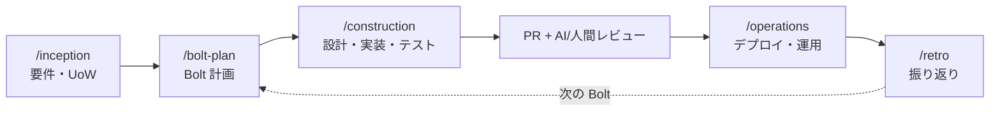

# AI-DLC スターターテンプレート（GitHub Copilot 用）

**AI-DLC（AI-Driven Development Life Cycle / AI 駆動開発ライフサイクル）** を
GitHub Copilot で今日から実践するためのテンプレートです。
AI を中心的な協働者にしつつ、**人間が監督・承認**することで、速度と品質を両立します。

> AI-DLC は AWS が提唱する方法論です（[原典](https://aws.amazon.com/blogs/devops/ai-driven-development-life-cycle/)）。
> 本テンプレートはその考え方を VS Code + GitHub Copilot のカスタマイズ機能に落とし込んだものです。

## これで何ができる？

- **3 フェーズのワークフロー**（着想 → 構築 → 運用）を、スラッシュコマンドで起動
- AI が必ず **計画 → 質問 → 人間の承認 → 実装** の順で進む（暴走させない）
- 要件・設計・意思決定を**リポジトリに永続化**し、セッションをまたいで継続
- **CI/CD と AI レビュー補助**、PR/Issue テンプレートを同梱
- **コスト最適化**の指針と設定を同梱

## 必要なもの

- [Visual Studio Code](https://code.visualstudio.com/)
- [GitHub Copilot](https://github.com/features/copilot) のサブスクリプション（無料プランでも可。高性能モデルは有料/プレミアムリクエスト）
- GitHub リポジトリ（CI/CD と AI レビュー補助を使う場合）

## クイックスタート

1. **テンプレートを取得**
   - GitHub なら「**Use this template**」、またはこのフォルダ一式を自分のリポジトリにコピー。
2. **VS Code で開く**
   - GitHub Copilot 拡張機能を入れてサインイン（`.vscode/extensions.json` が推奨拡張を提案します）。`.vscode/settings.json` がカスタマイズを自動で有効化します。
3. **自分のスタックに合わせる**
   - [.github/copilot-instructions.md](.github/copilot-instructions.md) の「ビルド・テスト」コマンドを更新。
   - 必要なら [.github/workflows/ci.yml](.github/workflows/ci.yml) のステップを自分の言語に合わせる。
4. **AI-DLC を開始**
   - Copilot Chat（エージェントモード）で次を順に実行:

   ```text
   /inception   # ① 要件・Unit of Work を固める
   /bolt-plan   # ② 短い作業サイクル（Bolt）を計画
   /construction# ③ 設計・実装・テスト
   /adr         #    重要な意思決定を記録（必要時）
   /operations  # ④ デプロイ・運用（必要時）
   /retro       # ⑤ 振り返り
   ```

## ワークフロー



各ステップで AI は計画を示し、不明点を質問し、**あなたの承認後**に実行します。
詳しい進め方は [docs/ai-dlc/00-overview.md](docs/ai-dlc/00-overview.md) を参照。

## 含まれるもの

| 種類                 | 場所                                                                                                      | 内容                                                                     |
| -------------------- | --------------------------------------------------------------------------------------------------------- | ------------------------------------------------------------------------ |
| エージェント指示     | [.github/copilot-instructions.md](.github/copilot-instructions.md)                                        | AI-DLC の中核ルール（常時適用）                                          |
| プロンプト           | [.github/prompts/](.github/prompts/)                                                                      | `inception` `bolt-plan` `construction` `adr` `operations` `retro`        |
| カスタムエージェント | [.github/agents/](.github/agents/)                                                                        | `inception` `construction` `operations` `reviewer`（役割別にツール制限） |
| ファイル別規約       | [.github/instructions/](.github/instructions/)                                                            | `code-style` `testing` `security` `documentation`                        |
| CI/CD                | [.github/workflows/](.github/workflows/)                                                                  | `ci` `ai-code-review` `ai-dlc-context-check`                             |
| Issue/PR             | [.github/ISSUE_TEMPLATE/](.github/ISSUE_TEMPLATE/) ・ [PR テンプレート](.github/PULL_REQUEST_TEMPLATE.md) | Unit of Work / Bolt / PR                                                 |
| ドキュメント         | [docs/ai-dlc/](docs/ai-dlc/)                                                                              | 各フェーズの手引き + [コスト最適化](docs/ai-dlc/cost-optimization.md)    |
| 永続コンテキスト     | [docs/ai-dlc/context/](docs/ai-dlc/context/)                                                              | `requirements` / `architecture` / `decisions(ADR)`                       |

## ディレクトリ構成

```text
.
├─ .github/
│  ├─ copilot-instructions.md      # 常に適用される AI-DLC ルール
│  ├─ agents/                      # カスタムエージェント（*.agent.md）
│  ├─ prompts/                     # スラッシュコマンド（*.prompt.md）
│  ├─ instructions/                # ファイル別規約（*.instructions.md）
│  ├─ workflows/                   # GitHub Actions
│  ├─ ISSUE_TEMPLATE/              # Unit of Work / Bolt
│  ├─ dependabot.yml               # 依存更新の自動 PR
│  └─ PULL_REQUEST_TEMPLATE.md
├─ .vscode/
│  ├─ settings.json                # カスタマイズの有効化
│  └─ extensions.json              # 推奨拡張機能（Copilot）
├─ docs/ai-dlc/                    # 方法論ガイド
│  └─ context/                     # 永続コンテキスト（要件/設計/ADR）
├─ .editorconfig                   # エディタ間の共通スタイル
├─ .gitignore
└─ README.md
```

## GitHub 側の推奨設定（任意だが推奨）

CI/CD と AI レビューを最大限活かすには:

1. **Actions を有効化**: リポジトリの Settings → Actions → 一般。
2. **ワークフローのコメント権限**: Settings → Actions → General →
   _Workflow permissions_ を **Read and write** に（PR への自動コメント用）。
3. **Copilot code review を有効化**: PR の Reviewers から **Copilot** を選択、または
   Settings/Rulesets で自動レビューを設定（[公式ドキュメント](https://docs.github.com/copilot/using-github-copilot/code-review)）。
4. **ブランチ保護 / ルールセット**: `main` で「PR レビュー必須」「CI 必須」を設定。

## カスタマイズ方法

| 変えたいこと                   | 編集するファイル                                                                                        |
| ------------------------------ | ------------------------------------------------------------------------------------------------------- |
| プロジェクト共通のルール       | [.github/copilot-instructions.md](.github/copilot-instructions.md)                                      |
| 言語・テスト・セキュリティ規約 | [.github/instructions/](.github/instructions/)                                                          |
| フェーズの進め方・質問内容     | [.github/prompts/](.github/prompts/) / [.github/agents/](.github/agents/)                               |
| ビルド/テスト/デプロイ         | [.github/copilot-instructions.md](.github/copilot-instructions.md) / [ci.yml](.github/workflows/ci.yml) |
| 使うモデル                     | VS Code のモデルピッカー（指針は [cost-optimization](docs/ai-dlc/cost-optimization.md)）                |

## コスト最適化（要点）

- 単純作業は**軽量モデル**、難所だけ**高性能モデル**（プレミアムリクエストを節約）
- 必要な箇所だけ読む。**永続コンテキストを再利用**して説明の繰り返しを避ける
- CI は重複実行をキャンセル、ドキュメント変更ではスキップ（設定済み）

詳細 → [docs/ai-dlc/cost-optimization.md](docs/ai-dlc/cost-optimization.md)

## トラブルシューティング

| 症状                            | 対処                                                                                                                |
| ------------------------------- | ------------------------------------------------------------------------------------------------------------------- |
| `/inception` などが候補に出ない | `.github/prompts/` にファイルがあるか確認。VS Code を再読み込み。設定 `chat.promptFiles` が true か確認             |
| 規約（instructions）が効かない  | 設定 `github.copilot.chat.codeGeneration.useInstructionFiles` が true か、frontmatter の `description` があるか確認 |
| PR にコメントが付かない         | Actions の _Workflow permissions_ が Read and write か確認                                                          |
| エージェントが勝手に実装する    | まず計画を求める。`copilot-instructions.md` の Plan→Ask→Confirm→Execute を再掲                                      |

## ライセンス

本プロジェクトは [MIT License](LICENSE) の下で公開されています。
プロジェクトに合わせて自由に改変してください。
