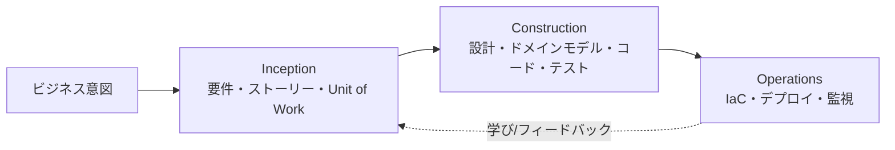

# AI-DLC 概要

**AI-DLC（AI-Driven Development Life Cycle / AI駆動開発ライフサイクル）** は、AI を「アシスタント」ではなく
**中心的な協働者**として開発全体に組み込む方法論です（AWS が 2025 年に提唱）。
人間が文脈と意思決定を担い、AI が計画・生成・実装の重労働を担います。

> 原典: [AI-Driven Development Life Cycle (AWS Blog)](https://aws.amazon.com/blogs/devops/ai-driven-development-life-cycle/)

## 中核メンタルモデル

AI はいきなり実装せず、**計画 → 質問 → 人間の承認 → 実装** を高速に繰り返します。

- **AI 主導の実行 + 人間の監督**: AI が詳細な作業計画を立て、不明点を質問し、重要な判断は人間に委ねる。
- **動的なチーム協働**: ルーチンを AI に任せ、人間はリアルタイムの検証・意思決定（Mob Elaboration / Mob Construction）に集中する。

## 3 つのフェーズ

| フェーズ             | 目的                     | 成果物                                   | 詳細                                    |
| -------------------- | ------------------------ | ---------------------------------------- | --------------------------------------- |
| Inception（着想）    | ビジネス意図を要件に変換 | 要件・ストーリー・受入基準・Unit of Work | [01-inception](./01-inception.md)       |
| Construction（構築） | 設計と実装               | アーキテクチャ・コード・テスト           | [02-construction](./02-construction.md) |
| Operations（運用）   | 安全な提供と運用         | IaC・CI/CD・監視                         | [03-operations](./03-operations.md)     |

各フェーズの成果物は **次フェーズのコンテキスト**になります。必ず `docs/ai-dlc/context/` に永続化してください。

## 用語

| AI-DLC               | 従来   | 意味                                 |
| -------------------- | ------ | ------------------------------------ |
| **Bolt**             | Sprint | 数時間〜数日の短い作業サイクル       |
| **Unit of Work**     | Epic   | まとまった価値の提供単位             |
| **Mob Elaboration**  | —      | チームで AI の要件提案を検証する協働 |
| **Mob Construction** | —      | チームで AI の技術提案を検証する協働 |

## このテンプレートでの実践

| やりたいこと       | 使うもの                                                                      |
| ------------------ | ----------------------------------------------------------------------------- |
| 要件を固める       | `/inception`（[エージェント](../../.github/agents/inception.agent.md)）       |
| Bolt を計画する    | `/bolt-plan`                                                                  |
| 設計・実装する     | `/construction`（[エージェント](../../.github/agents/construction.agent.md)） |
| 意思決定を記録する | `/adr`                                                                        |
| デプロイ・運用する | `/operations`（[エージェント](../../.github/agents/operations.agent.md)）     |
| 振り返る           | `/retro`                                                                      |
| コードレビュー     | レビューアエージェント / Copilot code review                                  |

導入と使い方は [README](../../README.md)、コスト方針は [cost-optimization](./cost-optimization.md) を参照してください。
